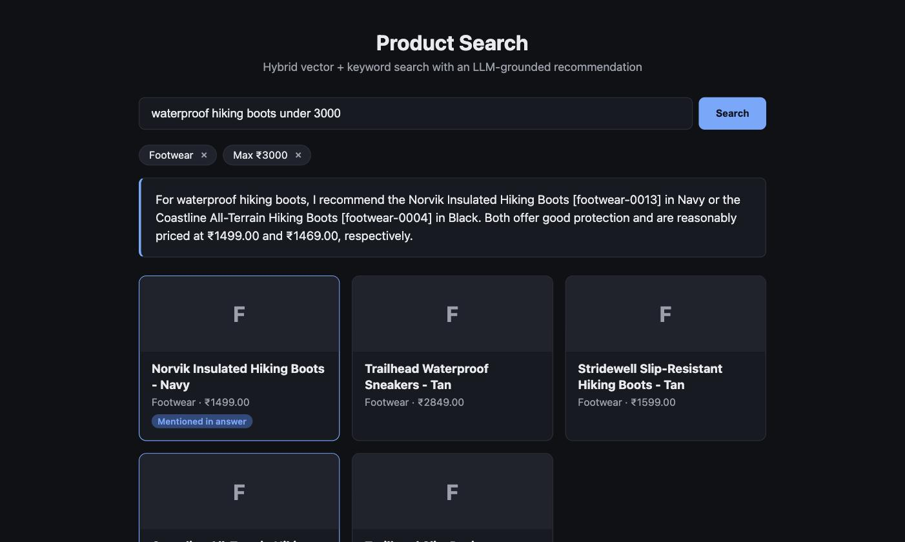
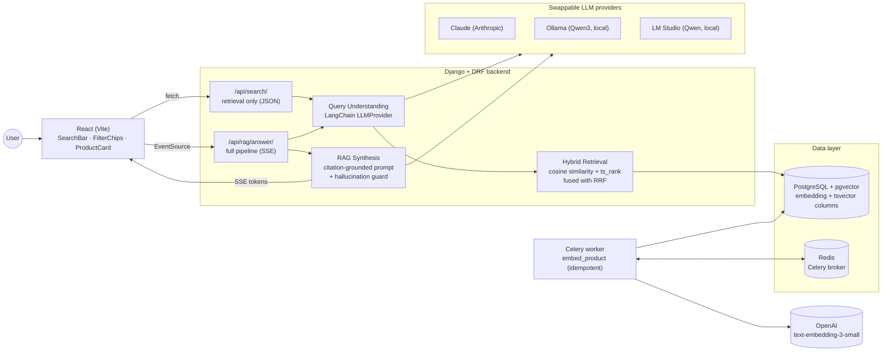

# Product Search — RAG-Powered Catalog Search

A portfolio project: type a natural-language query like *"waterproof
hiking boots under ₹3000"* and get back a ranked, filtered set of
products plus a short LLM-generated recommendation that references the
actual matched products — built on **hybrid (vector + keyword) retrieval**
with an **LLM query-understanding layer** in front and a **grounded RAG
synthesis** step on top.



Built end-to-end across 9 phases (see [`PROJECT_PLAN.md`](PROJECT_PLAN.md)
for the full phase-by-phase build log, checklists, and decisions made
along the way): Django/DRF backend, Celery async ingestion, LangChain
query understanding, streamed RAG synthesis, and a React frontend.

## Architecture



Two retrieval endpoints exist deliberately: `/api/search/` (Phases 3–4,
plain JSON) is what [`eval/run_eval.py`](eval/run_eval.py) hits — cheap,
fast, no LLM synthesis cost — while `/api/rag/answer/` (Phase 5) layers
the streamed, grounded recommendation on top for the actual UI.

## Tech stack

| Layer | Choice |
|---|---|
| Backend | Django + Django REST Framework |
| Database | PostgreSQL + `pgvector` (vectors) + native `tsvector` (keyword search) |
| Async | Celery + Redis |
| Embeddings | OpenAI `text-embedding-3-small`, behind a swappable `EmbeddingProvider` interface |
| Orchestration | LangChain (query understanding + RAG chain) |
| LLM | Claude (default), Ollama, or LM Studio — swappable via `LLMProvider` + `LLM_PROVIDER` env var |
| Frontend | React (Vite), plain CSS, `fetch`/`EventSource` — no UI framework |
| Containerization | Docker Compose (5 services: postgres, redis, django, celery, react) |
| Deploy target | Render (see [`render.yaml`](render.yaml)) |

## Setup

### Option A — Docker Compose (recommended)

```sh
git clone https://github.com/sandip-gavade/rag-product-search.git
cd rag-product-search
cp .env.example .env
# edit .env: at minimum set OPENAI_API_KEY and ANTHROPIC_API_KEY, OR set
# EMBEDDING_PROVIDER=lmstudio and LLM_PROVIDER=ollama/lmstudio to run
# entirely free and local instead — see "Choosing a provider" below

docker compose up -d --build
```

This brings up Postgres+pgvector, Redis, the Django API, a Celery worker,
and the React dev server. The backend container runs `migrate` then
`seed_catalog` (500 synthetic products) automatically on boot.

- Frontend: <http://localhost:5173>
- API: <http://localhost:8000/api/search/?q=hiking+boots>

**Populate embeddings** (needs either a real `OPENAI_API_KEY`, or
`EMBEDDING_PROVIDER=lmstudio` with LM Studio running locally — see
"Choosing an embeddings provider" below):

```sh
docker compose exec backend python manage.py ingest_catalog
```

This is a separate step from seeding on purpose — seeding is instant and
free; ingestion calls an embeddings API (paid for `openai`, free/local for
`lmstudio`). `ingest_catalog` is idempotent (safe to re-run; unchanged
products are skipped — see
[`ingestion/tasks.py`](backend/ingestion/tasks.py)) and runs inline by
default, or pass `--async` to enqueue via the Celery worker instead.

### Option B — Manual (no Docker)

```sh
# 1. Postgres + Redis only, via Docker (or install both natively)
docker compose up -d db redis

# 2. Backend
cd backend
python3 -m venv .venv && .venv/bin/pip install -r requirements.txt
cp ../.env.example ../.env   # edit as above
.venv/bin/python manage.py migrate
.venv/bin/python manage.py seed_catalog
.venv/bin/python manage.py ingest_catalog   # needs OPENAI_API_KEY, or EMBEDDING_PROVIDER=lmstudio
.venv/bin/python manage.py runserver 8000

# in a second terminal — Celery worker (needed for async ingestion / production)
.venv/bin/celery -A config worker --loglevel=info

# 3. Frontend, in a third terminal
cd frontend
npm install
npm run dev
```

### Choosing an embeddings provider

Set `EMBEDDING_PROVIDER` in `.env`:

| Value | Needs | Dimensions | Notes |
|---|---|---|---|
| `openai` | `OPENAI_API_KEY` | 1536 | `text-embedding-3-small`, paid |
| `lmstudio` | [LM Studio](https://lmstudio.ai) running locally, `nomic-embed-text-v1.5` loaded | 768 | Free, local; `LMSTUDIO_EMBEDDING_MODEL`/`LMSTUDIO_BASE_URL` |

The two are **not interchangeable at runtime** — the `Product.embedding`
column is a fixed-width `pgvector(N)` and Postgres rejects an insert of
the wrong width outright, and vectors from two different models aren't
comparable anyway. Switching providers means updating
`EMBEDDING_DIMENSIONS` in [`catalog/models.py`](backend/catalog/models.py),
running a migration to resize the column and rebuild the HNSW index, and
re-running `ingest_catalog` for every product (see that constant's
docstring for the exact steps). This repo currently ships configured for
`lmstudio` (768-dim) as the zero-cost default — the full pipeline
(embeddings + query understanding + synthesis) has been verified running
genuinely end-to-end against a local LM Studio instance, including live
in the browser.

### Choosing an LLM provider

Set `LLM_PROVIDER` in `.env`:

| Value | Needs | Notes |
|---|---|---|
| `anthropic` (default) | `ANTHROPIC_API_KEY` | Claude Opus 5 |
| `ollama` | [Ollama](https://ollama.com) running locally, `ollama pull qwen3:8b` | Free, local; `OLLAMA_MODEL`/`OLLAMA_BASE_URL` |
| `lmstudio` | [LM Studio](https://lmstudio.ai) running locally with a model loaded | Free, local; `LMSTUDIO_MODEL`/`LMSTUDIO_BASE_URL` |

Two local-model quirks were found and fixed via live testing against a
real LM Studio instance — see
[`query_understanding/providers/lmstudio_provider.py`](backend/query_understanding/providers/lmstudio_provider.py):

- LM Studio's OpenAI-compatible server rejects LangChain's default
  structured-output method (it only accepts string `tool_choice` values,
  not a forced-tool object).
- Qwen3-family **reasoning** models (tested: `qwen/qwen3.5-9b`) route
  structured JSON output into a `reasoning_content` field instead of
  `content` when served through LM Studio's OpenAI-compat layer, which
  breaks LangChain's `with_structured_output()` outright
  (`ValueError: ... does not have a 'parsed' field nor a 'refusal'
  field`). `parse_query()` bypasses LangChain for this call and reads the
  raw client response with a `content` → `reasoning_content` fallback.
  Reasoning models are also **much slower** for synthesis in practice
  (47s+ for a short answer on `qwen3.5-9b` vs. low single-digit seconds
  on a comparable non-reasoning model) — **prefer a non-reasoning
  instruct model** for `lmstudio`. This repo was verified end-to-end with
  `qwen2.5-7b-instruct`.

## Why hybrid search over pure vector search

Vector similarity is good at *meaning* — "waterproof" and "weatherproof"
land close together — but bad at *exact terms*: a SKU, a brand name, or a
specific spec (`GORE-TEX`, `256GB`) can get diluted in a dense embedding
even when it's the single most important word in the query. Keyword
search (Postgres full-text via `tsvector`/`ts_rank`) is the reverse: exact
and cheap, but blind to synonyms and paraphrase.

Running both and fusing the results gets the strengths of each. The fusion
method matters too: this project uses **Reciprocal Rank Fusion** (see
[`search/fusion.py`](backend/search/fusion.py)) instead of a weighted sum
of raw scores, because cosine distance and `ts_rank` live on incomparable
scales — one is a bounded distance, the other an unbounded,
corpus-dependent weight sum — with no natural normalization between them.
RRF sidesteps that by fusing on *rank position* instead of raw score.

[`eval/results.md`](eval/results.md) shows this concretely — see below for
a specific, real failure case caught by this project's own eval harness.

## Evaluation results

Generated by [`eval/run_eval.py`](eval/run_eval.py) against 33 queries
whose ground truth ([`eval/queries.json`](eval/queries.json)) is derived
directly from the seeded catalog, not hand-typed — see
[`eval/generate_queries.py`](eval/generate_queries.py).

These are **genuine numbers from a fully local run** — real embeddings
(`nomic-embed-text-v1.5` via LM Studio, all 500 products), real query
understanding and RRF fusion, no stubs. `/api/search/` runs the full
Phase 3+4 pipeline (query understanding *and* retrieval), so these
numbers reflect both stages together, not retrieval in isolation.

**A genuine failure case worth calling out**, because it's more useful
than a clean number: `non-stick frying pan` scores **0.00**. Not a bug —
the local 7B model classified it as `category: "Electronics"` instead of
`"Home & Kitchen"`, and since category is applied as a hard SQL filter,
every correct product became structurally unreachable regardless of how
good the ranking underneath was. `electric kettle`, `knife set`, `air
fryer`, and `yoga mat` fail the same way. This is a real, instructive
argument for treating LLM-extracted filters as a *ranking signal* rather
than a hard `WHERE` clause in a production system — this project uses the
simpler hard-filter design deliberately, and the eval harness is what
surfaces the cost of that choice concretely instead of leaving it
theoretical.

<!-- eval-results-start -->
| Query | Precision@5 | Precision@10 | Latency (ms) |
|---|---|---|---|
| waterproof hiking boots | 0.80 | 0.60 | 4339 |
| waterproof hiking boots under 3000 | 0.20 | 0.20 | 3420 |
| running shoes | 1.00 | 0.50 | 1771 |
| formal shoes | 1.00 | 1.00 | 2234 |
| waterproof sandals under 2000 | 0.20 | 0.11 | 2424 |
| rain boots | 0.00 | 0.20 | 2558 |
| wireless earbuds | 1.00 | 0.80 | 2525 |
| bluetooth speaker | 1.00 | 0.60 | 2277 |
| mechanical keyboard | 1.00 | 0.60 | 2566 |
| power bank | 1.00 | 1.00 | 1695 |
| laptop stand under 7000 | 0.80 | 0.60 | 2556 |
| webcam | 1.00 | 1.00 | 1688 |
| denim jacket | 0.80 | 0.60 | 1542 |
| cotton t-shirt | 1.00 | 0.90 | 2437 |
| wool sweater | 1.00 | 0.50 | 2473 |
| puffer jacket | 0.40 | 0.20 | 2636 |
| chino trousers | 0.60 | 0.30 | 2655 |
| non-stick frying pan | 0.00 | 0.00 | 2483 |
| electric kettle | 0.00 | 0.00 | 1409 |
| knife set | 0.00 | 0.00 | 2221 |
| air fryer | 0.00 | 0.00 | 1481 |
| camping tent | 1.00 | 0.90 | 2159 |
| yoga mat | 0.00 | 0.00 | 2261 |
| trekking backpack | 1.00 | 1.00 | 2787 |
| cycling helmet | 1.00 | 0.80 | 2502 |
| facial cleanser | 1.00 | 0.90 | 2458 |
| sunscreen lotion | 1.00 | 1.00 | 2882 |
| electric toothbrush | 1.00 | 0.80 | 2727 |
| mystery novel | 1.00 | 0.80 | 1459 |
| science fiction novel | 1.00 | 1.00 | 1463 |
| board game | 1.00 | 0.60 | 1726 |
| building block set | 1.00 | 0.70 | 1914 |
| remote control car | 1.00 | 0.90 | 2682 |
| **Average (33/33 queries)** | **0.72** | **0.58** | **2315** |
<!-- eval-results-end -->

Latency (~2.3s avg) is query-understanding-bound, not retrieval-bound —
the actual hybrid search is single-digit milliseconds; every request here
pays for a local LLM call to parse the query first. `run_eval.py` hits
`/api/search/`, not the streamed `/api/rag/answer/`, so no answer-synthesis
latency is included either.

## Testing

```sh
cd backend
.venv/bin/python manage.py test
```

70 tests across 5 apps (`catalog`, `ingestion`, `search`,
`query_understanding`, `rag`), all using mocked providers — no real API
calls in the suite, no network dependency to run it.

## Project structure

```
rag/
├── PROJECT_PLAN.md          # phase-by-phase build log, checklists, decisions
├── docker-compose.yml       # db, redis, backend, celery, frontend
├── render.yaml              # deploy config (Render blueprint)
├── backend/
│   ├── catalog/             # Product model, synthetic-catalog generator, seed command
│   ├── ingestion/           # EmbeddingProvider interface, Celery embed task
│   ├── search/               # hybrid retrieval (vector + keyword + RRF fusion)
│   ├── query_understanding/ # LLMProvider interface, LangChain query-parsing chain
│   └── rag/                  # grounded answer synthesis, streamed endpoint
├── frontend/                # React (Vite) UI
├── eval/                    # precision@k + latency evaluation harness
└── docs/                    # README assets
```

## Known limitations

- **The Anthropic/OpenAI (Claude + `text-embedding-3-small`) path has not
  been exercised with real, funded API keys in this repo's development
  history** — every phase was built and tested (mocked) with those
  providers' failure/fallback paths live-verified instead. The fully
  local path (LM Studio: `nomic-embed-text-v1.5` + `qwen2.5-7b-instruct`)
  *has* been run genuinely end-to-end — real embeddings for all 500
  products, real query understanding, real streamed synthesis — see the
  eval results above and [`PROJECT_PLAN.md`](PROJECT_PLAN.md) for the
  session that did it. `EMBEDDING_DIMENSIONS` (`catalog/models.py`) is
  currently set to 768 to match the local default; switching to OpenAI
  needs the migration described in that constant's comment.
- The synthetic catalog (Phase 1) has no product images — `ProductCard`
  shows a category-initial placeholder tile instead of sourcing/hosting
  placeholder images for generated data.
- `render.yaml` is a documented starting point, not a verified-live
  deployment — see the caveats in its header comment.
