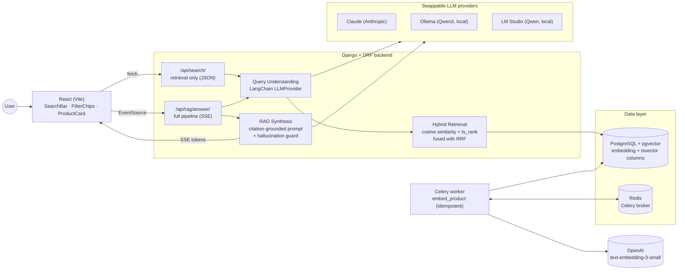

# Product Search — RAG-Powered Catalog Search

A portfolio project: type a natural-language query like *"waterproof
hiking boots under ₹3000"* and get back a ranked, filtered set of
products plus a short LLM-generated recommendation that references the
actual matched products — built on **hybrid (vector + keyword) retrieval**
with an **LLM query-understanding layer** in front and a **grounded RAG
synthesis** step on top.


Built end-to-end across 9 phases (see [`PROJECT_PLAN.md`](PROJECT_PLAN.md)
for the full phase-by-phase build log, checklists, and decisions made
along the way): Django/DRF backend, Celery async ingestion, LangChain
query understanding, streamed RAG synthesis, and a React frontend.

## Architecture



Two retrieval endpoints exist deliberately: `/api/search/` (Phases 3–4,
plain JSON) is what [`eval/run_eval.py`](eval/run_eval.py) hits — cheap,
fast, no LLM synthesis cost — while `/api/rag/answer/` (Phase 5) layers
the streamed, grounded recommendation on top for the actual UI.

## Tech stack

| Layer | Choice |
|---|---|
| Backend | Django + Django REST Framework |
| Database | PostgreSQL + `pgvector` (vectors) + native `tsvector` (keyword search) |
| Async | Celery + Redis |
| Embeddings | OpenAI `text-embedding-3-small`, behind a swappable `EmbeddingProvider` interface |
| Orchestration | LangChain (query understanding + RAG chain) |
| LLM | Claude (default), Ollama, or LM Studio — swappable via `LLMProvider` + `LLM_PROVIDER` env var |
| Frontend | React (Vite), plain CSS, `fetch`/`EventSource` — no UI framework |
| Containerization | Docker Compose (5 services: postgres, redis, django, celery, react) |
| Deploy target | Render (see [`render.yaml`](render.yaml)) |

## Setup

### Option A — Docker Compose (recommended)

```sh
git clone https://github.com/sandip-gavade/rag-product-search.git
cd rag-product-search
cp .env.example .env
# edit .env: at minimum set OPENAI_API_KEY and ANTHROPIC_API_KEY (or
# LLM_PROVIDER=ollama / lmstudio to use a local model instead — see below)

docker compose up -d --build
```

This brings up Postgres+pgvector, Redis, the Django API, a Celery worker,
and the React dev server. The backend container runs `migrate` then
`seed_catalog` (500 synthetic products) automatically on boot.

- Frontend: <http://localhost:5173>
- API: <http://localhost:8000/api/search/?q=hiking+boots>

**Populate embeddings** (needs a real `OPENAI_API_KEY` in `.env`):

```sh
docker compose exec backend python manage.py ingest_catalog
```

This is a separate step from seeding on purpose — seeding is instant and
free; ingestion calls a paid embeddings API. `ingest_catalog` is
idempotent (safe to re-run; unchanged products are skipped — see
[`ingestion/tasks.py`](backend/ingestion/tasks.py)) and runs inline by
default, or pass `--async` to enqueue via the Celery worker instead.

### Option B — Manual (no Docker)

```sh
# 1. Postgres + Redis only, via Docker (or install both natively)
docker compose up -d db redis

# 2. Backend
cd backend
python3 -m venv .venv && .venv/bin/pip install -r requirements.txt
cp ../.env.example ../.env   # edit as above
.venv/bin/python manage.py migrate
.venv/bin/python manage.py seed_catalog
.venv/bin/python manage.py ingest_catalog   # needs OPENAI_API_KEY
.venv/bin/python manage.py runserver 8000

# in a second terminal — Celery worker (needed for async ingestion / production)
.venv/bin/celery -A config worker --loglevel=info

# 3. Frontend, in a third terminal
cd frontend
npm install
npm run dev
```

### Choosing an LLM provider

Set `LLM_PROVIDER` in `.env`:

| Value | Needs | Notes |
|---|---|---|
| `anthropic` (default) | `ANTHROPIC_API_KEY` | Claude Opus 5 |
| `ollama` | [Ollama](https://ollama.com) running locally, `ollama pull qwen3:8b` | Free, local; `OLLAMA_MODEL`/`OLLAMA_BASE_URL` |
| `lmstudio` | [LM Studio](https://lmstudio.ai) running locally with a model loaded | Free, local; `LMSTUDIO_MODEL`/`LMSTUDIO_BASE_URL` |

Local-model note: LM Studio's OpenAI-compatible server rejects
LangChain's default structured-output method (it only accepts string
`tool_choice` values, not a forced-tool object) — `LMStudioProvider`
works around this with `method="json_schema"`. Found and fixed via live
testing against a real LM Studio instance during development; see
[`query_understanding/providers/lmstudio_provider.py`](backend/query_understanding/providers/lmstudio_provider.py).

## Why hybrid search over pure vector search

Vector similarity is good at *meaning* — "waterproof" and "weatherproof"
land close together — but bad at *exact terms*: a SKU, a brand name, or a
specific spec (`GORE-TEX`, `256GB`) can get diluted in a dense embedding
even when it's the single most important word in the query. Keyword
search (Postgres full-text via `tsvector`/`ts_rank`) is the reverse: exact
and cheap, but blind to synonyms and paraphrase.

Running both and fusing the results gets the strengths of each. The fusion
method matters too: this project uses **Reciprocal Rank Fusion** (see
[`search/fusion.py`](backend/search/fusion.py)) instead of a weighted sum
of raw scores, because cosine distance and `ts_rank` live on incomparable
scales — one is a bounded distance, the other an unbounded,
corpus-dependent weight sum — with no natural normalization between them.
RRF sidesteps that by fusing on *rank position* instead of raw score.

[`eval/results.md`](eval/results.md) makes the case concretely (see below):
plain-product-type queries ("running shoes", "board game") score a
perfect 1.00 on keyword search alone, but queries needing synonym
matching ("waterproof" vs. a title that says "All-Terrain") or price-phrase
stripping score near zero without the LLM/embedding half doing its job —
exactly the failure modes hybrid retrieval plus query understanding
exist to fix.

## Evaluation results

Generated by [`eval/run_eval.py`](eval/run_eval.py) against 33 queries
whose ground truth ([`eval/queries.json`](eval/queries.json)) is derived
directly from the seeded catalog, not hand-typed — see
[`eval/generate_queries.py`](eval/generate_queries.py).

**Caveat on these specific numbers:** they're a **keyword-only baseline**.
This project was built without a paid `OPENAI_API_KEY` or `ANTHROPIC_API_KEY`
on hand, so no product has a real embedding here yet — query embeddings
were stubbed out for just this one eval run (deterministic vectors, no
network call, fully reverted immediately after — never part of the
committed code) purely to unblock the endpoint's mandatory query-embedding
step. Vector search legitimately contributes nothing in this run (no
product has an embedding to compare against), so every score below is
what Postgres full-text search alone achieves. Re-run `manage.py
ingest_catalog` with a real key and re-run `eval/run_eval.py` to see the
hybrid numbers.

<!-- eval-results-start -->
| Query | Precision@5 | Precision@10 | Latency (ms) |
|---|---|---|---|
| waterproof hiking boots | 0.00 | 0.00 | 25 |
| waterproof hiking boots under 3000 | 0.00 | 0.00 | 15 |
| running shoes | 1.00 | 1.00 | 17 |
| formal shoes | 1.00 | 1.00 | 17 |
| waterproof sandals under 2000 | 0.00 | 0.00 | 14 |
| rain boots | 1.00 | 1.00 | 15 |
| wireless earbuds | 1.00 | 1.00 | 16 |
| bluetooth speaker | 1.00 | 1.00 | 22 |
| mechanical keyboard | 1.00 | 1.00 | 16 |
| power bank | 1.00 | 1.00 | 16 |
| laptop stand under 7000 | 0.00 | 0.00 | 14 |
| webcam | 1.00 | 1.00 | 15 |
| denim jacket | 0.40 | 0.60 | 16 |
| cotton t-shirt | 1.00 | 1.00 | 15 |
| wool sweater | 1.00 | 1.00 | 16 |
| puffer jacket | 1.00 | 1.00 | 16 |
| chino trousers | 1.00 | 1.00 | 15 |
| non-stick frying pan | 1.00 | 1.00 | 19 |
| electric kettle | 1.00 | 1.00 | 15 |
| knife set | 1.00 | 1.00 | 16 |
| air fryer | 1.00 | 1.00 | 18 |
| camping tent | 1.00 | 1.00 | 16 |
| yoga mat | 1.00 | 1.00 | 16 |
| trekking backpack | 1.00 | 1.00 | 16 |
| cycling helmet | 1.00 | 1.00 | 16 |
| facial cleanser | 1.00 | 1.00 | 15 |
| sunscreen lotion | 1.00 | 1.00 | 15 |
| electric toothbrush | 1.00 | 1.00 | 16 |
| mystery novel | 1.00 | 1.00 | 16 |
| science fiction novel | 1.00 | 1.00 | 15 |
| board game | 1.00 | 1.00 | 17 |
| building block set | 1.00 | 1.00 | 15 |
| remote control car | 1.00 | 1.00 | 16 |
| **Average (33/33 queries)** | **0.86** | **0.87** | **16** |
<!-- eval-results-end -->

## Testing

```sh
cd backend
.venv/bin/python manage.py test
```

70 tests across 5 apps (`catalog`, `ingestion`, `search`,
`query_understanding`, `rag`), all using mocked providers — no real API
calls in the suite, no network dependency to run it.

## Project structure

```
rag/
├── PROJECT_PLAN.md          # phase-by-phase build log, checklists, decisions
├── docker-compose.yml       # db, redis, backend, celery, frontend
├── render.yaml              # deploy config (Render blueprint)
├── backend/
│   ├── catalog/             # Product model, synthetic-catalog generator, seed command
│   ├── ingestion/           # EmbeddingProvider interface, Celery embed task
│   ├── search/               # hybrid retrieval (vector + keyword + RRF fusion)
│   ├── query_understanding/ # LLMProvider interface, LangChain query-parsing chain
│   └── rag/                  # grounded answer synthesis, streamed endpoint
├── frontend/                # React (Vite) UI
├── eval/                    # precision@k + latency evaluation harness
└── docs/                    # README assets
```

## Known limitations

- **No live embeddings/LLM calls have been exercised end-to-end with real
  API keys in this repo's development history** — every phase was built,
  tested (mocked), and had its failure/fallback paths live-verified
  without a funded `OPENAI_API_KEY`/`ANTHROPIC_API_KEY`. The one exception
  is `LMStudioProvider`, live-tested against a real local LM Studio
  instance. Add your own keys to see the full hybrid pipeline in action.
- The synthetic catalog (Phase 1) has no product images — `ProductCard`
  shows a category-initial placeholder tile instead of sourcing/hosting
  placeholder images for generated data.
- `render.yaml` is a documented starting point, not a verified-live
  deployment — see the caveats in its header comment.
